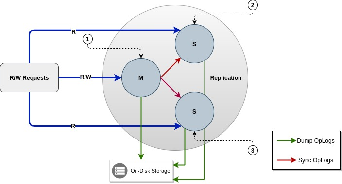

# photon-dance-consistent-hashing

**photon-dance-consistent-hashing** is designed to provide high-available and high-performance consistent-hashing service in distributed manner supported by replication + oplog.

### Reference

* [Consistent Hashing, Danny Lewin, and the Creation of Akamai - MIT Prof. Tom Leighton](https://www.youtube.com/watch?v=apHAqUG3Pi8)
* [Consistent Hashing and Random Trees: Distributed Caching Protocols for Relieving Hot Spots on the World Wide Web](https://www.akamai.com/us/en/multimedia/documents/technical-publication/consistent-hashing-and-random-trees-distributed-caching-protocols-for-relieving-hot-spots-on-the-world-wide-web-technical-publication.pdf)
* [Consistent Hashing with Bounded Loads](https://arxiv.org/pdf/1608.01350.pdf)
* [A Fast, Minimal Memory, Consistent Hash Algorithm](https://arxiv.org/pdf/1406.2294.pdf)

## Contributing

### Step 1

* 🍴 Fork this repo!

### Step 2

* 🔨 HACK AWAY!

### Step 3

* 🔃 Create a new PR using https://github.com/amazingchow/photon-dance-consistent-hashing/compare!

## Support

* Reach out to me at <jianzhou42@163.com>.

## License

* This project is licensed under the MIT License - see the **[MIT license](http://opensource.org/licenses/mit-license.php)** for details.
